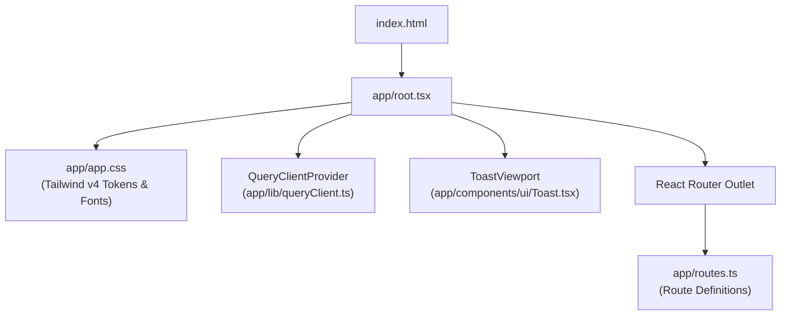
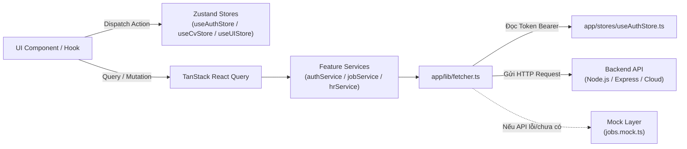
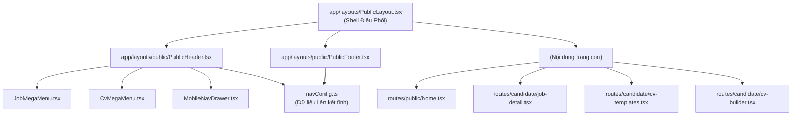
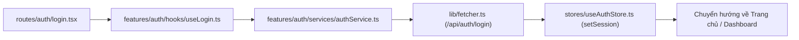
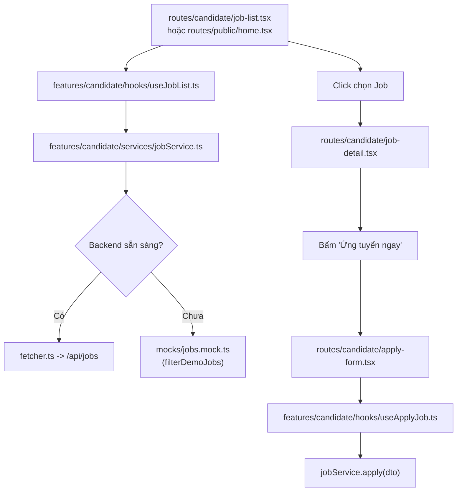
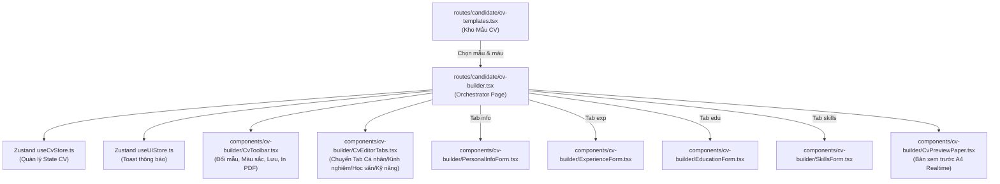
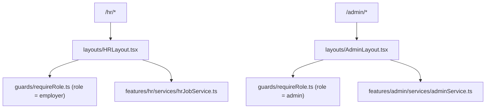

# 🗺️ Bản Đồ Luồng Kiến Trúc & Tệp Tin (FutureCV Frontend Flow Map)

Tài liệu này mô tả chi tiết sơ đồ luồng dữ liệu (Data Flow), luồng gọi hàm (Call Flow), sự phụ thuộc giữa các file và gom nhóm theo từng chức năng trong hệ thống **FutureCV Frontend**.

---

## 📌 Mục lục các Nhóm Chức năng
1. [Khởi tạo & Cốt lõi Hệ thống (App Core & Providers)](#1-khởi-tạo--cốt-lõi-hệ-thống-app-core--providers)
2. [Hạ tầng Giao tiếp API & State Toàn cục (Lib & Global Stores)](#2-hạ-tầng-giao-tiếp-api--state-toàn-cục-lib--global-stores)
3. [Giao diện Công khai (Public Layout, Trang chủ & Mega Menu)](#3-giao-diện-công-khai-public-layout-trang-chủ--mega-menu)
4. [Xác thực & Phân quyền (Authentication & Authorization)](#4-xác-thực--phân-quyền-authentication--authorization)
5. [Ứng viên - Tìm kiếm & Ứng tuyển Việc làm (Job Search & Apply Flow)](#5-ứng-viên---tìm-kiếm--ứng-tuyển-việc-làm-job-search--apply-flow)
6. [Ứng viên - Quản lý & Biên tập CV (CV Templates & CV Builder Flow)](#6-ứng-viên---quản-lý--biên-tập-cv-cv-templates--cv-builder-flow)
7. [Nhà tuyển dụng & Quản trị viên (HR & Admin Portal)](#7-nhà-tuyển-dụng--quản-trị-viên-hr--admin-portal)
8. [Design System & UI Primitives](#8-design-system--ui-primitives)

---

## 1. Khởi tạo & Cốt lõi Hệ thống (App Core & Providers)

### 📊 Sơ đồ luồng khởi động


### 📁 Chi tiết tệp:
| Đường dẫn tệp | Nhiệm vụ | Đi đến (Gọi / Sử dụng tệp nào) | Được gọi bởi (File cha) |
| :--- | :--- | :--- | :--- |
| `app/root.tsx` | Khung gốc HTML, nhúng font chữ, cung cấp `QueryClientProvider`, `ToastViewport` và bắt lỗi toàn cục (`ErrorBoundary`). | `app/app.css`<br>`app/lib/queryClient.ts`<br>`app/components/ui/Toast.tsx` | React Router runtime |
| `app/routes.ts` | Khai báo toàn bộ cấu trúc URL, Layout lồng nhau (`PublicLayout`, `AuthLayout`) và Route Handlers. | `app/layouts/PublicLayout.tsx`<br>`app/layouts/AuthLayout.tsx`<br>`app/routes/*` | `app/root.tsx` |
| `app/app.css` | Hệ thống Design Tokens (màu sắc Navy/Gold, typography Hanken Grotesk, container utilities). | Toàn bộ components | `app/root.tsx` |

---

## 2. Hạ tầng Giao tiếp API & State Toàn cục (Lib & Global Stores)

### 📊 Sơ đồ luồng State & Network


### 📁 Chi tiết tệp:
| Đường dẫn tệp | Nhiệm vụ | Tệp liên quan / Luồng gọi |
| :--- | :--- | :--- |
| `app/lib/fetcher.ts` | HTTP Client bọc hàm `fetch`, tự động chèn JWT Bearer token từ `useAuthStore`, parse lỗi `ApiError`. | ➡️ Gọi bởi tất cả các service tại `app/features/*/services/` |
| `app/lib/queryClient.ts` | Khởi tạo cấu hình cache mặc định (`staleTime: 5m`, `retry: 1`) cho TanStack Query. | ➡️ Cung cấp tại `app/root.tsx` |
| `app/lib/queryKeys.ts` | Tập trung hóa các Query Key factory (`auth`, `jobs`, `cv`, `applications`). | ➡️ Dùng trong các custom query hooks |
| `app/lib/cn.ts` | Tiện ích gộp className Tailwind (`clsx` + `tailwind-merge`). | ➡️ Dùng trong toàn bộ component UI |
| `app/stores/useAuthStore.ts` | Quản lý phiên đăng nhập (User, AccessToken, RefreshToken), tự động lưu `localStorage`. | ➡️ Dùng bởi `fetcher.ts`, `PublicHeader.tsx`, `useLogin.ts`, `guards` |
| `app/stores/useCvStore.ts` | Quản lý dữ liệu bản nháp CV (Personal info, kinh nghiệm, học vấn, kỹ năng, màu sắc). | ➡️ Dùng bởi `cv-builder.tsx` và các sub-forms |
| `app/stores/useUIStore.ts` | Quản lý thông báo Toast tức thời (`showToast`, `hideToast`). | ➡️ Dùng bởi `root.tsx`, `cv-builder.tsx`, `job-detail.tsx` |

---

## 3. Giao diện Công khai (Public Layout, Trang chủ & Mega Menu)

### 📊 Sơ đồ luồng Component Public Layout


### 📁 Chi tiết tệp:
| Tệp nguồn | Tệp đích / Tệp con | Nhiệm vụ |
| :--- | :--- | :--- |
| `app/layouts/PublicLayout.tsx` | `PublicHeader.tsx`<br>`PublicFooter.tsx`<br>`<Outlet />` | Khung Layout bao bọc Header, Main Content và Footer. |
| `app/layouts/public/PublicHeader.tsx` | `JobMegaMenu.tsx`<br>`CvMegaMenu.tsx`<br>`MobileNavDrawer.tsx`<br>`useAuthStore.ts` | Header chính, quản lý Hover Dropdown Mega Menu và hiển thị Avatar người dùng. |
| `app/layouts/public/JobMegaMenu.tsx` | `navConfig.ts` | Mega Menu 3 cột cho Việc làm (Hành động, Vị trí, Ngành nghề). |
| `app/layouts/public/CvMegaMenu.tsx` | `navConfig.ts` | Menu Dropdown Tạo CV (Style CV, Vị trí, Quản lý CV). |
| `app/layouts/public/MobileNavDrawer.tsx` | `useAuthStore.ts` | Drawer điều hướng trên điện thoại khi mở menu hamburger. |
| `app/layouts/public/PublicFooter.tsx` | `navConfig.ts` | Chân trang thông tin công ty và liên kết ứng viên/nhà tuyển dụng. |
| `app/layouts/public/navConfig.ts` | Các menu và Footer | Dữ liệu cấu hình link menu theo Open/Closed Principle. |
| `app/routes/public/home.tsx` | `JobCard.tsx`<br>`useJobList.ts`<br>`useCandidateFilterStore.ts` | Trang chủ tìm kiếm việc làm, banner hero, công ty hàng đầu. |

---

## 4. Xác thực & Phân quyền (Authentication & Authorization)

### 📊 Sơ đồ luồng Đăng nhập & Đăng ký


### 📁 Chi tiết tệp:
| Đường dẫn tệp | Nhiệm vụ | Luồng kết nối |
| :--- | :--- | :--- |
| `app/layouts/AuthLayout.tsx` | Layout chia đôi màn hình (bên trái banner thương hiệu FutureCV, bên phải form nhập liệu). | Bao bọc `login.tsx`, `register.tsx`, `forgot-password.tsx` |
| `app/routes/auth/login.tsx` | Giao diện form đăng nhập email/mật khẩu. | ➡️ Gọi `useLogin.ts` |
| `app/routes/auth/register.tsx` | Giao diện đăng ký ứng viên hoặc nhà tuyển dụng. | ➡️ Gọi `useRegister.ts` |
| `app/routes/auth/forgot-password.tsx` | Giao diện yêu cầu cấp lại mật khẩu qua email. | ➡️ Gọi `authService.forgotPassword` |
| `app/features/auth/services/authService.ts` | Gọi các endpoint `/api/auth/*` qua `fetcher.ts`. | ➡️ Dùng bởi các hooks `useLogin`, `useRegister` |
| `app/guards/requireAuth.ts` | Client Loader kiểm tra đã đăng nhập chưa, nếu chưa điều hướng về `/login`. | ➡️ Gắn vào các trang yêu cầu tài khoản |
| `app/guards/requireRole.ts` | Kiểm tra role tài khoản (`candidate`, `employer`, `admin`). | ➡️ Gắn vào các layout HR/Admin |

---

## 5. Ứng viên - Tìm kiếm & Ứng tuyển Việc làm (Job Search & Apply Flow)

### 📊 Sơ đồ luồng Xem tin & Nộp đơn


### 📁 Chi tiết tệp:
| Đường dẫn tệp | Nhiệm vụ | Đi đến (File liên kết) |
| :--- | :--- | :--- |
| `app/routes/candidate/job-list.tsx` | Trang danh sách việc làm với bộ lọc đa tiêu chí (địa điểm, mức lương, kinh nghiệm). | `useJobList.ts`<br>`components/shared/JobCard.tsx` |
| `app/routes/candidate/job-detail.tsx` | Chi tiết công việc (Mô tả, yêu cầu, phúc lợi, công ty, việc làm tương tự). | `jobService.ts`<br>`components/shared/JobCard.tsx` |
| `app/routes/candidate/apply-form.tsx` | Form nộp hồ sơ ứng tuyển (chọn CV đã tạo hoặc tải lên file PDF mới). | `useApplyJob.ts`<br>`jobService.ts` |
| `app/features/candidate/services/jobService.ts` | Service chuẩn `IJobService` xử lý nộp đơn, lấy danh sách và chi tiết công việc. | `lib/fetcher.ts`<br>`mocks/jobs.mock.ts` |
| `app/features/candidate/mocks/jobs.mock.ts` | Kho dữ liệu 8+ công việc demo (`DEMO_JOBS`) và hàm tìm kiếm cục bộ (`filterDemoJobs`). | `jobService.ts` |

---

## 6. Ứng viên - Quản lý & Biên tập CV (CV Templates & CV Builder Flow)

### 📊 Sơ đồ luồng Tái cấu trúc CV Builder (SOLID Decomposition)


### 📁 Chi tiết tệp trong Module CV:
| Tệp nguồn | Nhiệm vụ cụ thể | Nguyên lý SOLID |
| :--- | :--- | :---: |
| `app/routes/candidate/cv-templates.tsx` | Hiển thị thư viện mẫu CV đa ngành nghề, lọc theo style và xem trước màu sắc. | **SRP** |
| `app/features/candidate/data/cvTemplates.ts` | Dữ liệu định nghĩa các mẫu CV (General, Harvard, Modern, Minimal, Designer, v.v.). | **OCP** |
| `app/routes/candidate/cv-builder.tsx` | Trang điều phối kết nối Zustand Store với các form nhập liệu và preview. | **SRP (Orchestrator)** |
| `app/features/candidate/components/cv-builder/CvToolbar.tsx` | Thanh công cụ: Chọn màu chủ đạo, Reset về mẫu gốc, Lưu CV, In PDF. | **SRP** |
| `app/features/candidate/components/cv-builder/CvEditorTabs.tsx` | Điều hướng tab nhập liệu (Cá nhân, Kinh nghiệm, Học vấn, Kỹ năng). | **SRP** |
| `app/features/candidate/components/cv-builder/PersonalInfoForm.tsx` | Form nhập họ tên, email, điện thoại, địa chỉ, avatar, mục tiêu nghề nghiệp. | **SRP & ISP** |
| `app/features/candidate/components/cv-builder/ExperienceForm.tsx` | Quản lý danh sách kinh nghiệm: thêm vị trí, cập nhật thời gian/mô tả, xóa vị trí. | **SRP & ISP** |
| `app/features/candidate/components/cv-builder/EducationForm.tsx` | Quản lý học vấn: thêm trường, cập nhật bằng cấp, GPA, xóa học vấn. | **SRP & ISP** |
| `app/features/candidate/components/cv-builder/SkillsForm.tsx` | Thêm thẻ kỹ năng (nhập nhanh Enter) và xóa kỹ năng. | **SRP & ISP** |
| `app/features/candidate/components/cv-builder/CvPreviewPaper.tsx` | Render bản in A4 thời gian thực với màu sắc và nội dung đồng bộ tức thì. | **SRP & ISP** |

---

## 7. Nhà tuyển dụng & Quản trị viên (HR & Admin Portal)

### 📊 Sơ đồ luồng Cổng Quản trị & Tuyển dụng


### 📁 Chi tiết tệp:
| Tệp nguồn | Nhiệm vụ | Đi đến (File liên kết) |
| :--- | :--- | :--- |
| `app/layouts/HRLayout.tsx` | Layout Dashboard cho Nhà tuyển dụng (Sidebar quản lý tin đăng, ứng viên, công ty). | `guards/requireRole.ts`<br>`features/hr/*` |
| `app/layouts/AdminLayout.tsx` | Layout Dashboard cho Quản trị viên hệ thống (Duyệt tin, quản lý user, thống kê). | `guards/requireRole.ts`<br>`features/admin/*` |
| `app/features/hr/services/hrJobService.ts` | Service xử lý đăng tin tuyển dụng, xem danh sách CV ứng tuyển. | `lib/fetcher.ts` |

---

## 8. Design System & UI Primitives

Tất cả các component trong thư mục `app/components/ui/` được xây dựng theo chuẩn **CVA (Class Variance Authority)** và tuân thủ **Liskov Substitution Principle**:

```
app/components/ui/
├── Button.tsx       -> Nút bấm đa biến thể (primary, accent, outline, ghost, danger)
├── Input.tsx        -> Ô nhập liệu hỗ trợ label, icon trái/phải, thông báo lỗi helper
├── Modal.tsx        -> Hộp thoại Dialog/Modal có backdrop mờ và nút đóng
├── Card.tsx         -> Khối thẻ nội dung chuẩn border và background token
├── Badge.tsx        -> Nhãn trạng thái (success, warning, info, gold, hot)
├── Avatar.tsx       -> Ảnh đại diện hoặc chữ viết tắt tự động tạo màu
├── Toast.tsx        -> Khung hiển thị Toast Viewport toàn màn hình
├── Table.tsx        -> Bảng dữ liệu responsive cho Dashboard
├── Skeleton.tsx     -> Hiệu ứng Placeholder đang tải dữ liệu
└── EmptyState.tsx   -> Giao diện thông báo khi không có dữ liệu tìm kiếm
```

---

## 🚀 Tóm tắt Kiến trúc Tổng thể

```
[UI Layer (Routes & Subcomponents)]
              ⬇️
[Hook & Query Layer (useJobList, useLogin, useCvStore)]
              ⬇️
[Service Layer (IJobService, authService)]
              ⬇️
[HTTP Client / Adapter (fetcher.ts <---> jobs.mock.ts)]
              ⬇️
[Backend REST API / Mock Fixtures]
```
Mô hình này giúp frontend:
1. **Dễ kiểm thử độc lập**: Có thể mock từng tầng service hoặc store.
2. **Không phụ thuộc cứng vào Backend**: Tự động fallback mock dữ liệu khi backend đang bảo trì hoặc chưa triển khai.
3. **Mở rộng tính năng tốc độ cao**: Thêm route mới chỉ cần gắn layout tương ứng và tạo feature folder độc lập.
